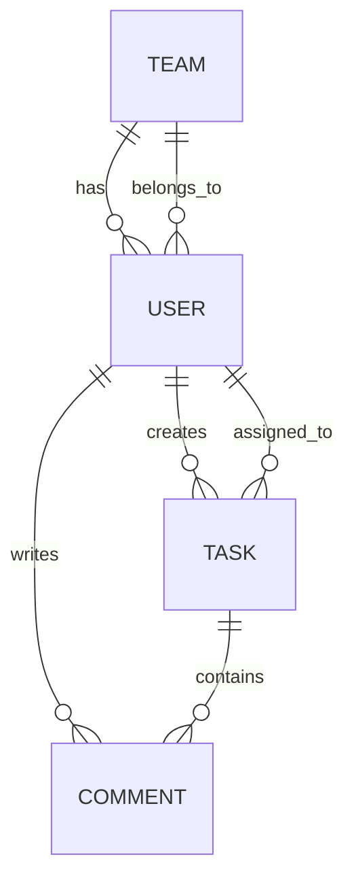

# Task Management System – Entity & Relationship Documentation

> **Domain**: Task Tracking & Collaboration App for Teams
> **Tech Stack**: Spring Boot, Spring Security (JWT), MySQL, REST APIs

All entities inherit from standard JPA and are automatically timestamped using auditing columns where applicable.

---

## 1  User (`users`)

| Column     | Type              | Constraints        |
| ---------- | ----------------- | ------------------ |
| `id`       | UUID              | PK, auto-generated |
| `username` | VARCHAR(100)      | NOT NULL, UNIQUE   |
| `email`    | VARCHAR(100)      | NOT NULL, UNIQUE   |
| `password` | VARCHAR(255)      | NOT NULL           |
| `role`     | ENUM (USER/ADMIN) | NOT NULL           |

**Relationships**

* `User` **1–1** `Team` — each user belongs to one team
* `User` **1–N** `Task` (creator)
* `User` **1–N** `Task` (assignee)
* `User` **1–N** `Comment` (author)

---

## 2  Team (`teams`)

| Column | Type         | Constraints        |
| ------ | ------------ | ------------------ |
| `id`   | UUID         | PK, auto-generated |
| `name` | VARCHAR(100) | NOT NULL, UNIQUE   |

**Relationships**

* `Team` **1–N** `User` — a team has multiple users

---

## 3  Task (`tasks`)

| Column        | Type                          | Constraints        |
| ------------- | ----------------------------- | ------------------ |
| `id`          | UUID                          | PK, auto-generated |
| `title`       | VARCHAR(100)                  | NOT NULL           |
| `description` | TEXT                          | NOT NULL           |
| `status`      | ENUM (TODO/IN\_PROGRESS/DONE) | NOT NULL           |
| `dueDate`     | DATE                          | nullable           |
| `priority`    | ENUM (LOW/MEDIUM/HIGH)        | nullable           |

**Relationships**

* `Task` **N–1** `User` (createdBy)
* `Task` **N–1** `User` (assignedTo)
* `Task` **1–N** `Comment`

---

## 4  Comment (`comments`)

| Column      | Type      | Constraints                |
| ----------- | --------- | -------------------------- |
| `id`        | UUID      | PK, auto-generated         |
| `content`   | TEXT      | NOT NULL                   |
| `createdAt` | TIMESTAMP | default CURRENT\_TIMESTAMP |

**Relationships**

* `Comment` **N–1** `User` (author)
* `Comment` **N–1** `Task` (task it belongs to)

---

## ER Diagram

---

## Postman Collection

All API endpoints can be tested using the following Postman workspace:

**[Open Postman Collection](https://postman.co/workspace/My-Workspace~cdcbeee0-d746-4fc7-8d02-e0e251ee9046/collection/34378314-acc2f40d-25f9-405f-8eb5-8ccc27fe4228?action=share&creator=34378314)**
